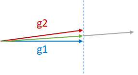
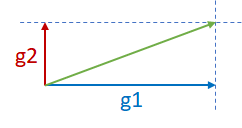
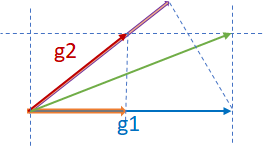
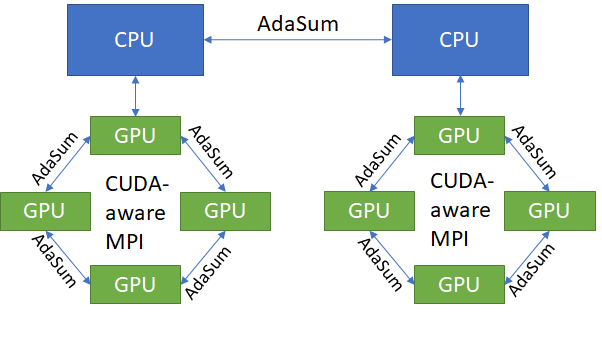
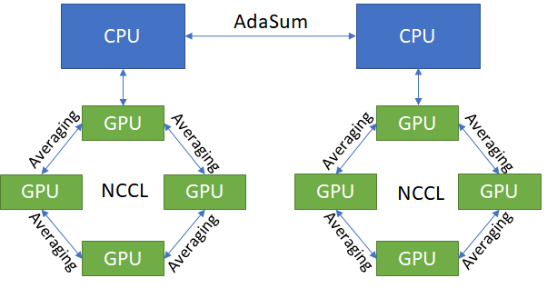

-   **Introduction to the AdaSum Algorithm**

Scaling DNN training to many GPUs always comes at a convergence degradation.
This is because with larger batch sizes, gradients are averaged and the learning
rate per example is smaller. To address this, learning rate is usually scaled up
but this can lead to divergence of model parameters. AdaSum addresses these two
issues without introducing any hyper-parameter.

Suppose there are two almost-parallel gradients from two different GPUs, g1 and
g2, and they need to be reduced as shown in the figure below. The two common
practices for reductions are g1+g2, the gray vector or (g1+g2)/2, the green
vector. g1+g2 may cause divergence of the model since it is effectively moving
in the direction of g1 or g2 by two times the magnitude of g1 or g2. Therefore,
generally (g1+g2)/2 is safer and more desired. Note that (g1+g2)/2 penalizes
both the components g1 and g2 equally.

Now consider the two orthogonal gradients g1 and g2 in the figure below. Since
g1 and g2 are in two different dimensions and independent of each other, g1+g2
may not cause divergence.

Finally, consider the third scenario where g1 and g2 are neither parallel nor
orthogonal as shown in the figure below. In such a case, where taking the sum
might cause a divergence, AdaSum controls the effect of the overall gradient
update by subtracting half of g1’s projection on g2(pink vector) from g2,
subtracting half of g2’s projection on g1 (orange vector) from g1, and summing
the two components together.

This formula reduces to a sum when g1 and g2 are orthogonal and an average when
g1 and g2 are parallel.

This idea extends to many gradients as well. Suppose there are 2\^n gradients
coming from 2\^n different GPUs. AdaSum inductively takes pairs of gradients and
reduces them using the method above until all of them are reduced into one
gradient. Thus, AdaSum needs the number of nodes to be a power of 2 in the
current implementation.

-   **The Distributed Optimizer for AdaSum**

AdaSum uses the Distributed AdaSum Optimizer to update the weights of the model
after each step.

In the usual data-parallel training scenario, the gradients are calculated
independently by backpropagating on all the nodes, doing a reduce(averaging the
gradients) so that all the nodes now have the same gradients, and then updating
the weights of the model.

The distributed optimizer for AdaSum first obtains the local gradients from the
backpropagation step from the current local mini batch. Instead of performing
the reduce at this point, it applies the optimization function to the local
gradients to perform the weight update. Then, the delta, which is the difference
in the weights before and after the update is obtained, which is then reduced
instead of the gradients. Once all the workers have the same delta, the weight
update step is then performed as the sum of the initial weights and delta.

Since the nature of AdaSum requires it to operate on the full magnitude of the
gradient, the newly added distributed optimizer uses the difference in magnitude
of weights between before and after the optimizer performs a step to deliver a
more accurate estimation.

-   **Installation and Usage Instructions**

AdaSum can be used and experimented with Horovod and Pytorch/TensorFlow.

In addition, there are two options of using AdaSum with Horovod- with MPI and
with NCCL. It can be noted that any valid implementation of MPI can be used, but
AdaSum has been tested with OpenMPI and IntelMPI.

-   **Setting up the environment**

>   Below are the requirements for running Horovod with AdaSum:

-   Appropriate Nvidia GPU drivers.

-   cuda-10.0 and cudnn-7.6.4

-   OpenMPI- 4.0

-   NCCL – 2.4

-   Python 3.7.5

-   Pytorch-1.2.0 OR

-   Tensorflow-1.14.0

-   Horovod-0.18.2

*Using NCCL:*

If HOROVOD_GPU_ALLREDUCE=NCCL flag is used to compile Horovod, NCCL is used
instead. In this case, NCCL will be used for intra-node communication, and
AdaSum will be used for inter-node communication.

-   **Modes of Operation**

Adasum can be used in the following ways depending on the hardware setup
available.

-   **Pure CPU**

When dealing with a hardware setup of multiple nodes, each node having worker
GPUs that are not connected by a high speed interconnect like NVLink, where the
communication happens through the CPU, AdaSum through MPI can be used for both
intra-node and inter-node communication. In this case, all of the AdaSum ops are
performed on the CPU.

If the hardware setup allows for a different mode like Ring or Hierarchical to
be used, those must be used instead to get the highest performance benefit.

-   **Ring**

On specifically configured machines (DGX1 nodes with 8 GPUs each), the Ring mode
can be used instead of the pure CPU mode. This mode is identical to the pure CPU
mode for inter-node communication, but is able to do intra-node communication
without going through the CPU. It does this by utilizing CUDA-aware MPI (OpenMPI
built with UCX support) in order to allow direct GPU to GPU communication within
nodes. This results in identical convergence benefits to pure CPU mode, but much
better throughput on nodes that support it.

Ring mode is currently supported only on **DGX1** nodes having 8 GPUs each.

-   **Hierarchical**

In cases where the hardware does not support Ring mode, but throughput higher
than that of the pure CPU mode is desired, the hierarchical mode can be used
instead.

The hierarchical mode functions similar to the Ring mode, except for using NCCL
to do regular averaging intra-node, instead of using CUDA-aware MPI to do AdaSum
like ring. Note that hierarchical also works on any hardware configuration, and
is not limited to DGX1s.

In practice, hierarchical yields the best throughput, but lowers the convergence
benefits of AdaSum due to some of the ops being regular averaging. As a rule of
thumb, typically the convergence benefit degradation is insignificant on
clusters with large numbers of nodes (\>=8), as in that case there are enough
inter-node AdaSum ops being performed. This is the ideal Hierarchical scenario.

The other reason to use Hierarchical even on smaller clusters is when Ring mode
is not supported, and CPU mode throughput is simply too low to be viable. Note
that in these cases the convergence benefits compared to not using AdaSum at all
might be minor.

The learning rate that should be used is equal to the best learning rate for a
single worker (GPU) scaled by the number of GPUs locally on a node. On very
large clusters, scaling this even more by another factor of 1.5-2.0x might give
better results but is not guaranteed and should be tried only if scaling by just
the local size is not sufficient for good convergence

-   **Modification to the code**

A new distributed optimizer has been added to both TensorFlow and Pytorch to
support the AdaSum algorithm.

An optional parameter op has been added to DistributedOptimizer and allreduce
API for users to specify which operation to perform.

When op=hvd.AdaSum is specified, the new optimizer will be used.

-   **TensorFlow**

    -   DistributedOptimizer

>   opt = tf.train.AdamOptimizer(0.001)

>   opt = hvd.DistributedOptimizer(opt, backward_passes_per_step=5,
>   **op=hvd.AdaSum**)

-   Allreduce

>   hvd.allreduce(tensor, **op=hvd.AdaSum**)

-   **Pytorch**

    -   DistributedOptimizer

>   optimizer = optim.SGD(model.parameters(), lr=args.lr,
>   momentum=args.momentum)

>   optimizer = hvd.DistributedOptimizer(optimizer,
>   named_parameters=model.named_parameters(), compression=compression,
>   backward_passes_per_step = 5, **op=hvd.AdaSum**)

-   Allreduce

>   hvd.allreduce(tensor, **op=hvd.AdaSum**)

-   **Square and Cubic optimization- A simple case study to understand AdaSum’s
    behavior**

In order to understand the behavior and potential benefits of AdaSum as compared
to Averaging, consider a simple experiment in squared optimization using AdaSum.

Here, the goal is to estimate the coefficients of a polynomial of degree 2. The
features are generated by randomly sampling a uniform distribution, and scaling
by a factor of x_max which can be specified. This sets the complexity of the
data that is used to estimate the coefficients. Additionally, the learning rate
and the op to be used for Allreduce can be specified as well. The true label is
calculated with the original true coefficients, without adding any noise.

In order to estimate the coefficients, Stochastic Gradient Descent is used. The
training is stopped once the gradients are zero for two consecutive runs.

This optimization can be run over a range of learning rates, number of workers
and data range (set by x_max). This can also be modified to a cubic optimization
problem.

This experiment can be run through the jupyter notebook **adasum_bench.ipynb**,
with the models being defined in **adasum_small_model.py**.

On running experiments with different number of workers, we can draw the
following conclusions for this simple scenario with plain SGD as the optimizer:

-   **On the number of steps for convergence:** For the same problem, AdaSum
    achieves the same accuracy (100% in this case) in lower number of steps as
    compared to averaging. Depending on the complexity of the problem, this
    reduction can be anywhere up to 50% for less complex square parameter
    optimization.

-   **On scaling learning rate for higher number of workers**: For traditional
    averaging, when the number of workers is increased with local batch size the
    same, this increases the global batch size, causing a higher smoothing
    effect on the gradients. To increase the speed of convergence, it is
    recommended that the learning rate be scaled up by the number of workers as
    recommended in the paper [Accurate, Large Minibatch SGD: Training ImageNet
    in 1 Hour](https://arxiv.org/abs/1706.02677).

>   **From this example, we see that with AdaSum, the LR need not be scaled
>   linearly with the number of workers, but a better scaling factor would be
>   2-2.5.**

-   **On using LR decay**: With AdaSum, we see that a form of regularization
    effect already takes place over the gradients. As the training progresses,
    the magnitude of the gradients reduces, simulating the same effect as that
    of decaying the learning rate. Although some decay might be necessary for
    training more complex models, this result must be kept in mind as the same
    extent of decay might not be necessary.

-   **MNIST- higher accuracy with the same number of steps**

Here, we test the applicability of the observations from the simple cubic
optimization problem to training MNIST with AdaSum. By scaling the best learning
rate for a single worker case by 2.5 while using AdaSum with higher number of
nodes, we see that we consistently get better accuracy with the same number of
steps as compared to averaging.

-   **Key Takeaways**

-   AdaSum ensures correct convergence behavior even with large effective batch
    sizes.

-   As the number of ranks scales up, the learning rate does not need to be
    scaled linearly if using CPU to do AdaSum reduction. A good scaling factor
    would be between 2-2.5 over the best learning rate for a single worker.

-   If HOROVOD_GPU_ALLREDUCE=NCCL flag is used to compile Horovod, the learning
    rate that should be used is equal to the best learning rate for a single
    worker (GPU) scaled by the number of GPUs locally on a node. On very large
    clusters, scaling this even more by another factor of 1.5-2.0x might give
    better results but is not guaranteed and should be tried only if scaling by
    just the local size is not sufficient for good convergence.

-   Pytorch training in fp16 format is not yet supported. Integration of Apex
    into the new optimizer to enabled full mixed precision training with AdaSum
    in Pytorch is a work in progress.

-   When HOROVOD_GPU_ALLREDUCE=NCCL flag is used to compile Horovod and training
    is run on a single node, only averaging through NCCL library is used to
    perform reductions and no AdaSum algorithm will take place in this
    configuration.
