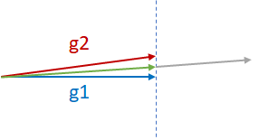
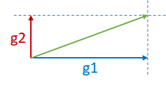
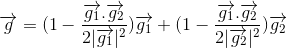
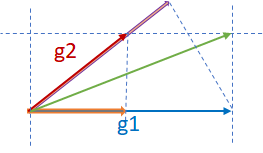
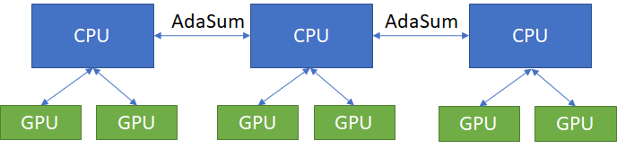
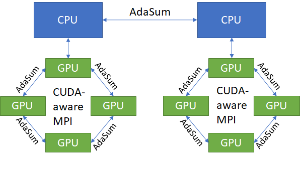
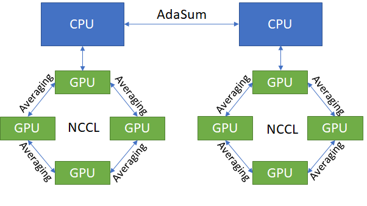

.. inclusion-marker-start-do-not-remove

AdaSum with Horovod
===================

The Adaptive Summation, or AdaSum, is a novel algorithm for improving distributed data parallel training of Deep Learning models. This improvement can be seen in different ways: reducing the number steps to achieve the same accuracy in some cases and allowing you to scale to more training workers without penalizing learning rate and convergence stability.
AdaSum can be used with Horovod and PyTorch/TensorFlow. 

|

.. Contents::

|

Introduction to the AdaSum Algorithm
======================================

Scaling DNN training to many GPUs always comes at a convergence degradation. This is because with larger batch sizes, gradients are averaged and the learning rate per example is smaller. To address this, learning rate is usually scaled up, but this can lead to divergence of model parameters. AdaSum addresses these two issues without introducing any hyperparameter.

Suppose there are two almost-parallel gradients from two different GPUs, g1 and g2, and they need to be reduced as shown in the figure below. The two common practices for reductions are g1+g2, the gray vector, or (g1+g2)/2, the green vector. g1+g2 may cause divergence of the model since it is effectively moving in the direction of g1 or g2 by two times the magnitude of g1 or g2. Therefore, generally (g1+g2)/2 is safer and more desired. Note that (g1+g2)/2 penalizes both the components g1 and g2 equally.

Now consider the two orthogonal gradients g1 and g2 in the figure below. Since g1 and g2 are in two different dimensions and independent of each other, g1+g2 may not cause divergence.

Finally, consider the third scenario where g1 and g2 are neither parallel nor orthogonal as shown in the figure below. In such a case, where taking the sum might cause a divergence, AdaSum controls the effect of the overall gradient update by subtracting half of g1’s projection on g2(pink vector) from g2, subtracting half of g2’s projection on g1 (orange vector) from g1, and summing the two components together.

This formula reduces to a sum when g1 and g2 are orthogonal and an average when g1 and g2 are parallel.

This idea extends to many gradients as well. Suppose there are 2\^n gradients coming from 2\^n different GPUs. AdaSum inductively takes pairs of gradients and reduces them using the method above until all of them are reduced into one gradient. Thus, AdaSum needs the number of nodes to be a power of 2 in the current implementation.

The Distributed Optimizer for AdaSum
======================================

AdaSum uses the Distributed AdaSum Optimizer to update the weights of the model after each step. In the usual data-parallel training scenario, the gradients are calculated independently by backpropagating on all the nodes, doing a reduce (averaging the gradients) so that all the nodes now have the same gradients, and then updating the weights of the model.

The distributed optimizer for AdaSum first obtains the local gradients from the backpropagation step from the current local mini batch. Instead of performing the reduce at this point, it applies the optimization function to the local gradients to perform the weight update. Then, the delta, which is the difference in the weights before and after the update is obtained, which is then reduced instead of the gradients. Once all the workers have the same delta, the weight update step is then performed as the sum of the initial weights and delta.

Since the nature of AdaSum requires it to operate on the full magnitude of the gradient, the newly added distributed optimizer uses the difference in magnitude of weights between before and after the optimizer performs a step to deliver a more accurate estimation.

Installation and Usage Instructions
=====================================

AdaSum can be used and experimented with Horovod and Pytorch/TensorFlow.

In addition, there are two options of using AdaSum with Horovod: with Message Passing Interface (MPI) and with `NCCL <https://developer.nvidia.com/nccl>`_. 
Any valid implementation of MPI can be used, but AdaSum has been tested with `OpenMPI <https://www.open-mpi.org/>`_ and `IntelMPI <https://software.intel.com/en-us/mpi-library>`_.

Setting up the environment
--------------------------

Below are the requirements for running Horovod with AdaSum:

-   cuda >= 6.0

-   OpenMPI >= 3.0

-   NCCL >= 2.0

-   Pytorch >= 1.2.0 OR

-   Tensorflow >= 1.11.0, < 2.0

-   Horovod >= 0.18.2

*Using NCCL:*

If the **HOROVOD_GPU_ALLREDUCE=NCCL** flag is used to compile Horovod, NCCL is used instead. In this case, NCCL will be used for intra-node communication, and AdaSum will be used for inter-node communication.

Modes of Operation
=====================

Adasum can be used in the following ways depending on the hardware setup available.

Pure CPU
--------------------------

When dealing with a hardware setup of multiple nodes, each node having worker GPUs that are not connected by a high speed interconnect like `NVLink <https://www.nvidia.com/en-us/data-center/nvlink/>`_, where the communication happens through the CPU, AdaSum through MPI can be used for both intra-node and inter-node communication. In this case, all of the AdaSum ops are performed on the CPU.

If the hardware setup allows for a different mode like Ring or Hierarchical to be used, those must be used instead to get the highest performance benefit.

Ring
--------------------------

On specifically configured machines (`DGX1 <https://www.nvidia.com/en-us/data-center/dgx-1/>`_ nodes with 8 GPUs each), the Ring mode can be used instead of the pure CPU mode. This mode is identical to the pure CPU mode for inter-node communication, but is able to do intra-node communication without going through the CPU. It does this by utilizing CUDA-aware MPI (OpenMPI built with `UCX <https://www.openucx.org/>`_ support) in order to allow direct GPU to GPU communication within nodes. This results in identical convergence benefits to pure CPU mode, but much better throughput on nodes that support it.

Ring mode is currently supported only on **DGX1** nodes having 8 GPUs each.

Hierarchical
--------------------------

In cases where the hardware does not support Ring mode, but throughput higher than that of the pure CPU mode is desired, the hierarchical mode can be used instead.

The hierarchical mode functions similar to the Ring mode, except for using NCCL to do regular averaging intra-node, instead of using CUDA-aware MPI to do an AdaSum-like ring. Note that hierarchical also works on any hardware configuration, and is not limited to DGX1s.

In practice, hierarchical yields the best throughput, but lowers the convergence benefits of AdaSum due to some of the ops being regular averaging. As a rule of thumb, typically the convergence benefit degradation is insignificant on clusters with large numbers of nodes (\>=8), as in that case there are enough inter-node AdaSum ops being performed. This is the ideal Hierarchical scenario.

The other reason to use Hierarchical even on smaller clusters is when Ring mode is not supported, and CPU mode throughput is simply too low to be viable. Note that in these cases the convergence benefits compared to not using AdaSum at all might be minor.

The learning rate that should be used is equal to the best learning rate for a single worker (GPU) scaled by the number of GPUs locally on a node. On very large clusters, scaling this even more by another factor of 1.5-2.0x might give better results but is not guaranteed and should be tried only if scaling by just the local size is not sufficient for good convergence

Modification to the code
===========================

A new distributed optimizer has been added to both TensorFlow and Pytorch to support the AdaSum algorithm.

An optional parameter **op** has been added to DistributedOptimizer and allreduce API for users to specify which operation to perform.
When **op=hvd.AdaSum** is specified, the new optimizer will be used.

AdaSum is highly effective in scaling to large batch sizes. The **backward_passes_per_step** parameter of the DistributedOptimizer can be used for gradient accumulation in order to scale to larger effective batch sizes without being limited by GPU memory.

TensorFlow
--------------------------

-   DistributedOptimizer

.. code-block:: python

    opt = tf.train.AdamOptimizer(0.001)
    opt = hvd.DistributedOptimizer(opt, backward_passes_per_step=5, op=hvd.AdaSum)

-   Allreduce

.. code-block:: python
    
    hvd.allreduce(tensor, op=hvd.AdaSum)

Pytorch
--------------------------

-   DistributedOptimizer

.. code-block:: python

    optimizer = optim.SGD(model.parameters(), lr=args.lr, momentum=args.momentum)
    optimizer = hvd.DistributedOptimizer(optimizer, named_parameters=model.named_parameters(), compression=compression, backward_passes_per_step = 5, op=hvd.AdaSum)

-   Allreduce

.. code-block:: python

    hvd.allreduce(tensor, op=hvd.AdaSum)

Case Studies
==============

Square and Cubic optimization
---------------------------------

**A simple case study to understand AdaSum’s behavior**

In order to understand the behavior and potential benefits of AdaSum as compared to Averaging, consider a simple experiment in squared optimization using AdaSum. Here, the goal is to estimate the coefficients of a polynomial of degree 2. The features are generated by randomly sampling a uniform distribution, and scaling by a factor of x_max which can be specified. This sets the complexity of the data that is used to estimate the coefficients. Additionally, the learning rate and the op to be used for Allreduce can be specified as well. The true label is calculated with the original true coefficients, without adding any noise.

In order to estimate the coefficients, Stochastic Gradient Descent is used. The training is stopped once the gradients are zero for two consecutive runs. This optimization can be run over a range of learning rates, number of workers and data range (set by x_max). This can also be modified to a cubic optimization problem.

This experiment can be run through the jupyter notebook `adasum_bench.ipynb <../examples/adasum_bench.ipynb>`_, with the models being defined in `adasum_small_model.py <../examples/adasum_small_model.py>`_.

On running experiments with a different number of workers, we can draw the following conclusions for this simple scenario with plain SGD as the optimizer:
 
-   **On the number of steps for convergence:** For the same problem, AdaSum achieves the same accuracy (100% in this case) in lower number of steps as compared to averaging. Depending on the complexity of the problem, this reduction can be anywhere up to 50% for less complex square parameter optimization.

-   **On scaling learning rate for higher number of workers**: For traditional averaging, when the number of workers is increased with local batch size the	same, this increases the global batch size, causing a higher smoothing effect on the gradients. To increase the speed of convergence, it is recommended that the learning rate be scaled up by the number of workers as	recommended in the paper `Accurate, Large Minibatch SGD: Training ImageNet	in 1 Hour <https://arxiv.org/abs/1706.02677>`_.

 **From this example, we see that with AdaSum, the LR need not be scaled linearly with the number of workers, but a better scaling factor would be 2-2.5.**

-   **On using LR decay**: With AdaSum, we see that a form of regularization effect already takes place over the gradients. As the training progresses, the magnitude of the gradients reduces, simulating the same effect as that of decaying the learning rate. Although some decay might be necessary for training more complex models, this result must be kept in mind as the same extent of decay might not be necessary.

MNIST
---------

**Higher accuracy with the same number of steps**

Here, we test the applicability of the observations from the simple cubic optimization problem to training MNIST with AdaSum. By scaling the best learning rate for a single worker case by 2.5 while using AdaSum with higher number of nodes, we see that we consistently get better accuracy with the same number of steps as compared to averaging.

|

Key Takeaways
===============

|

-   AdaSum ensures correct convergence behavior even with large effective batch sizes.

-   As the number of ranks scales up, the learning rate does not need to be scaled linearly if using CPU to do AdaSum reduction. A good scaling factor would be between 2\-2.5 over the best learning rate for a single worker.

-   If the HOROVOD_GPU_ALLREDUCE=NCCL flag is used to compile Horovod, the learning rate that should be used is equal to the best learning rate for a single	worker (GPU) scaled by the number of GPUs locally on a node. On very large	clusters, scaling this even more by another factor of 1.5\-2.0x might give	better results but is not guaranteed and should be tried only if scaling by just the local size is not sufficient for good convergence.

-   Pytorch training in fp16 format is not yet supported. Integration of Apex	into the new optimizer to enabled full mixed precision training with AdaSum in Pytorch is a work in progress.

-   When HOROVOD_GPU_ALLREDUCE=NCCL flag is used to compile Horovod and training	is run on a single node, only averaging through NCCL library is used to	perform reductions and no AdaSum algorithm will take place in this configuration.

.. inclusion-marker-end-do-not-remove
