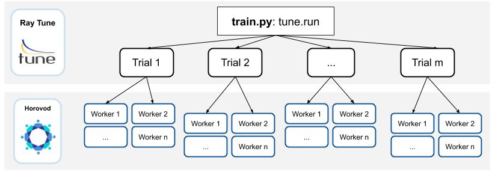

.. inclusion-marker-start-do-not-remove

Distributed Hyperparameter Search
=================================

Horovod's data parallelism training capabilities allow you to scale out and speed up the workload of training a deep learning model. However, simply using 2x more workers does not necessarily mean the model will obtain the same accuracy in 2x less time.

To address this, you often need to re-tune hyperparameters when training at scale, as many hyperparameters exhibit different behaviors at larger scales.

Horovod offers a `Ray Tune`_ integration to enable parallel hyperparameter tuning with distributed training.

`Ray Tune`_ is an industry standard tool for distributed hyperparameter tuning. `Ray Tune`_ includes the latest hyperparameter search algorithms, integrates with TensorBoard and other analysis libraries, and natively supports distributed training. The `Ray Tune`_ + Horovod integration leverages the underlying Ray framework to provide a scalable and comprehensive hyperparameter tuning setup.

**By the end of this guide, you will learn:**

* How to set up `Ray Tune`_ and Horovod to tune your hyperparameters
* Typical hyperparameters to configure for distributed training

Horovod + Ray Tune
------------------

Leverage `Ray Tune`_ with Horovod to combine distributed hyperparameter tuning with distributed training. Here is an example demonstrating basic usage:

.. code-block:: python

    import horovod.torch as hvd
    from ray import tune
    import time

    def training_function(config: Dict):
        hvd.init()
        for i in range(config["epochs"]):
            time.sleep(1)
            model = Model(learning_rate=config["lr"])
            tune.report(test=1, rank=hvd.rank())

    trainable = DistributedTrainableCreator(
            training_function, num_slots=2, use_gpu=use_gpu)
    analysis = tune.run(
        trainable,
        num_samples=2,
        config={
            "epochs": tune.grid_search([1, 2, 3]),
            "lr": tune.grid_search([0.1, 0.2, 0.3]),
        }
    )
    print(analysis.best_config)

Basic setup
-----------

Use Ray Tune's `DistributedTrainableCreator`_ function to adapt your Horovod training function to be compatible with Ray Tune.

`DistributedTrainableCreator`_ exposes ``num_hosts``, ``num_slots``, ``use_gpu``, and ``num_cpus_per_slot``. Use these parameters to specify the resource allocation of a single "trial" (or "Trainable") which itself can be a distributed training job.

.. code-block:: python

    # Each training job will use 2 GPUs.
    trainable = DistributedTrainableCreator(
        training_function, num_slots=2, use_gpu=True)

The training function itself must do three things:

1. It must adhere to the `Tune Function API signature <https://docs.ray.io/en/latest/tune/api_docs/trainable.html#function-api>`__.
2. Its body must include a ``horovod.init()`` call.
3. It must call ``tune.report`` (`docs <https://docs.ray.io/en/latest/tune/api_docs/trainable.html#tune-report-tune-checkpoint-function-api>`__) during training, typically called iteratively at the end of every epoch.

Optimization of hyperparameters
-------------------------------

`Ray Tune`_ is able to orchestrate complex computational patterns with the `Ray Actor API <https://docs.ray.io/en/latest/actors.html>`__. For hyperparameter tuning, `Ray Tune`_ is able to conduct `parallel bayesian optimization <https://docs.ray.io/en/latest/tune/api_docs/suggestion.html>`__ and `Population Based Training <https://docs.ray.io/en/latest/tune/api_docs/schedulers.html>`__ on a group of distributed models.

You may need to implement model checkpointing. The rest of the optimization process can be configured with a couple lines of code.

.. code-block:: python

    from ray import tune
    from ray.tune.suggest.bayesopt import BayesOptSearch
    from ray.tune.suggest import ConcurrencyLimiter

    def training_function(config):
        ...

    algo = BayesOptSearch()
    algo = ConcurrencyLimiter(algo, max_concurrent=4)
    results = tune.run(
        training_function,
        config={"lr": tune.uniform(0.001, 0.1)},
        name="horovod",
        metric="mean_loss",
        mode="min",
        search_alg=algo)

    print(results.best_config)

**Search Space**

Tune has a native interface for `specifying search spaces <https://docs.ray.io/en/master/tune/api_docs/search_space.html#tune-search-space>`__. You can specify the search space via ``tune.run(config=...)``.

Thereby, either use the ``tune.grid_search`` primitive to specify an axis of a grid search...

.. code-block:: python

    tune.run(
        trainable,
        config={"bar": tune.grid_search([True, False])})

... or one of the random sampling primitives to specify distributions:

.. code-block:: python

    tune.run(
        trainable,
        config={
            "param1": tune.choice([True, False]),
            "bar": tune.uniform(0, 10),
            "alpha": tune.sample_from(lambda _: np.random.uniform(100) ** 2),
            "const": "hello"  # It is also ok to specify constant values.
        })

Read more about Tune's `Search Space API <https://docs.ray.io/en/master/tune/api_docs/search_space.html#tune-search-space>`__.

**Analyzing Results**

``tune.run`` returns an `Analysis <https://docs.ray.io/en/master/tune/api_docs/analysis.html>`__ object which has methods for analyzing your training.

.. code-block:: python

    analysis = tune.run(trainable, search_alg=algo, stop={"training_iteration": 20})

    best_trial = analysis.best_trial  # Get best trial
    best_config = analysis.best_config  # Get best trial's hyperparameters
    best_logdir = analysis.best_logdir  # Get best trial's logdir
    best_checkpoint = analysis.best_checkpoint  # Get best trial's best checkpoint
    best_result = analysis.best_result  # Get best trial's last results
    best_result_df = analysis.best_result_df  # Get best result as pandas dataframe

Set up a tuning cluster
-----------------------

Leverage `Ray Tune`_ with Horovod on a laptop, single machine with multiple GPUs, or across multiple machines. To run on a single machine, execute your Python script as-is (for example, `horovod_simple.py <https://docs.ray.io/en/latest/tune/examples/horovod_simple.html>`__, assuming Ray and Horovod are installed properly):

.. code-block:: bash

    python horovod_simple.py

To leverage a distributed hyperparameter tuning setup with `Ray Tune`_ + Horovod, install Ray and set up a `Ray cluster <https://docs.ray.io/en/latest/cluster/index.html>`__. Start a Ray cluster with the `Ray Cluster Launcher <https://docs.ray.io/en/latest/cluster/launcher.html>`__ or manually.

Below, we’ll use the `Ray Cluster Launcher <https://docs.ray.io/en/latest/cluster/launcher.html>`__, but you can start Ray on any list of nodes, on any cluster manager or cloud provider.

First, specify a configuration file. Below we have an example of using AWS EC2, but you can launch the cluster on any cloud provider:

.. code-block:: yaml

    # ray_cluster.yaml
    cluster_name: horovod-cluster
    provider: {type: aws, region: us-west-2}
    auth: {ssh_user: ubuntu}
    min_workers: 3
    max_workers: 3

    # Deep Learning AMI (Ubuntu) Version 21.0
    head_node: {InstanceType: p3.2xlarge, ImageId: ami-0b294f219d14e6a82}
    worker_nodes: {
        InstanceType: p3.2xlarge, ImageId: ami-0b294f219d14e6a82}
    setup_commands: # Set up each node.
        - HOROVOD_WITH_GLOO=1 HOROVOD_GPU_OPERATIONS=NCCL pip install horovod[ray]

Run ``ray up ray_cluster.yaml``, and a cluster of 4 nodes (1 head node + 3 worker nodes) will be automatically started with Ray.

.. code-block:: bash

    [6/6] Starting the Ray runtime
    Did not find any active Ray processes.
    Shared connection to 34.217.192.11 closed.
    Local node IP: 172.31.43.22
    2020-11-04 04:24:33,882 INFO services.py:1106 -- View the Ray dashboard at http://localhost:8265

    --------------------
    Ray runtime started.
    --------------------

    Next steps
      To connect to this Ray runtime from another node, run
        ray start --address='172.31.43.22:6379' --redis-password='5241590000000000'

      Alternatively, use the following Python code:
        import ray
        ray.init(address='auto', _redis_password='5241590000000000')

      If connection fails, check your firewall settings and network configuration.

      To terminate the Ray runtime, run
        ray stop
    Shared connection to 34.217.192.11 closed.
      New status: up-to-date

    Useful commands
      Monitor autoscaling with
        ray exec ~/dev/cfgs/check-autoscaler.yaml 'tail -n 100 -f /tmp/ray/session_latest/logs/monitor*'
      Connect to a terminal on the cluster head:
        ray attach ~/dev/cfgs/check-autoscaler.yaml
      Get a remote shell to the cluster manually:
        ssh -o IdentitiesOnly=yes -i ~/.ssh/ray-autoscaler_2_us-west-2.pem ubuntu@34.217.192.11

After the cluster is up, you can ssh into the head node and run your Tune script there.

Implementation (underneath the hood)
------------------------------------

Underneath the hood, `Ray Tune`_ will launch multiple "`trials <https://docs.ray.io/en/latest/tune/key-concepts.html#tune-run-and-trials>`__" in parallel. Each of these trials reference a `set of Ray actors <https://docs.ray.io/en/latest/actors.html>`__. For each trial, there will be 1 “coordinator actor,” and this coordinator actor will manage N training actors. One basic assumption of this implementation is that all sub-workers of a trial will be placed evenly across different machines.

Training actors will each hold a copy of the model and will create a communication group for Horovod allreduce. Training will execute on each actor, reporting intermediate metrics back to Tune.

This API requires Gloo as the underlying communication primitive. Be sure to install Horovod with ``HOROVOD_WITH_GLOO`` `enabled <https://horovod.readthedocs.io/en/stable/install_include.html#gloo>`__.

Common Hyperparameters
----------------------

We will cover a couple common hyperparameters that you may need to re-tune at scale:

1. Batch Size
2. Learning Rate schedules
3. Optimizers

Parameter: Batch size
~~~~~~~~~~~~~~~~~~~~~

By using data parallelism, it is necessary to scale the batch size along with workers to avoid reducing the per-worker workload and maximizing worker efficiency. However, increasing batch size can easily cause generalization issues (see this `Facebook Imagenet Training paper <https://research.fb.com/wp-content/uploads/2017/06/imagenet1kin1h5.pdf>`__ for more details).

**What are common solutions?**

* Linear scaling of learning rates: When the minibatch size is multiplied by k, multiply the learning rate by k.
* Dynamically adjusting batch size over the course of training:

  - One of the original papers presents a simple baseline of increasing the batch size over time
  - `ABSA provides a way <https://openreview.net/pdf?id=H1lnJ2Rqt7>`__ to leverage second order information to guide the batch size over time
  - `Gradient noise scale <https://openai.com/blog/science-of-ai/>`__ can be calculated to guide the increase of batch size over time

To leverage a dynamically changing batch size in training, you should either:

* Leverage `gradient accumulation <https://gist.github.com/thomwolf/ac7a7da6b1888c2eeac8ac8b9b05d3d3>`__
* Implement your own TrialScheduler to dynamically change the number of workers (coming soon)

Parameter: Learning rate schedules (warmup)
~~~~~~~~~~~~~~~~~~~~~~~~~~~~~~~~~~~~~~~~~~~

As noted in this `Facebook Imagenet Training paper <https://research.fb.com/wp-content/uploads/2017/06/imagenet1kin1h5.pdf>`__, the linear scaling rule breaks down when the network is rapidly changing, which commonly occurs in early stages of training. This issue can be addressed with a "warmup," which is a strategy of using less aggressive learning rates at the start of training.

**What are common solutions?**

Goyal et al. (2017) proposes a warm-up schedule, where training usually starts with a small learning rate, and gradually increased to match a larger target learning rate. After the warm-up period (usually a few epochs), a regular learning rate schedule is used ("multi-steps", polynomial decay etc). Thus, there are generally three parameters for warmup schedule:

* Length of warmup (number of epochs)
* Starting learning rate
* Peak learning rate

Parameter: Optimizers
~~~~~~~~~~~~~~~~~~~~~

Optimizers are algorithms/methods that are used to update network weights iteratively. Common optimizers in deep learning include Adam, RMSProp, and SGD with momentum.

In large scale learning, naive approaches to optimizing and updating neural network weights can lead to poor generalization or decreased performance. For example,  Alexnet on Imagenet using standard SGD with momentum (and a warmup scheme) will stop scaling after ``B=2K``.

**What are common solutions?**

* `LARS <https://arxiv.org/pdf/1708.03888.pdf>`__ calculates a local learning rate per layer at each optimization step. It normalizes the gradient magnitude of each layer and instead uses a user-set coefficient and magnitude of the layer weights to compute the learning rate. The original paper for LARS presents performance improvements for training AlexNet with large batch sizes.
* `LAMB <https://towardsdatascience.com/an-intuitive-understanding-of-the-lamb-optimizer-46f8c0ae4866>`__ stands for “Layer-wise Adaptive Moments optimizer for Batch training.” It makes a few small changes to LARS. In spirit, it is “combining the ADAM optimizer with layer-wise scaling of LARS”. The original motivation of the LAMB work is because LARS did not work well for attention-based architectures such as BERT.

.. _`Ray Tune`: https://docs.ray.io/en/latest/tune/

.. _`DistributedTrainableCreator`: https://docs.ray.io/en/latest/tune/api_docs/integration.html#horovod-tune-integration-horovod

.. inclusion-marker-end-do-not-remove
